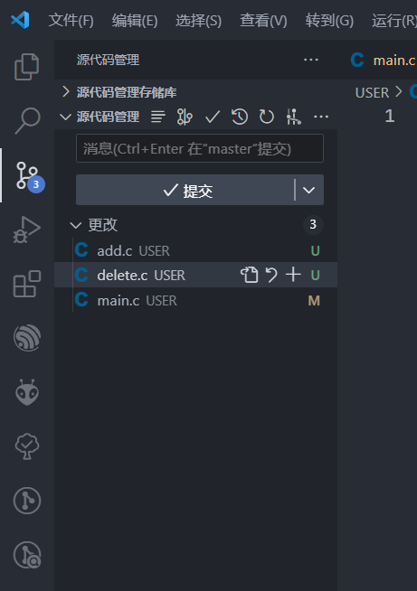
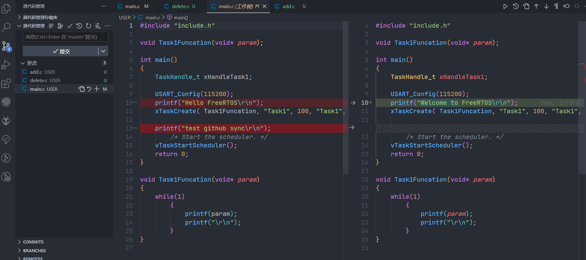
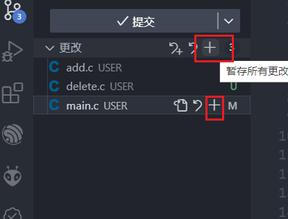
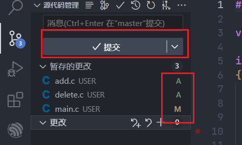
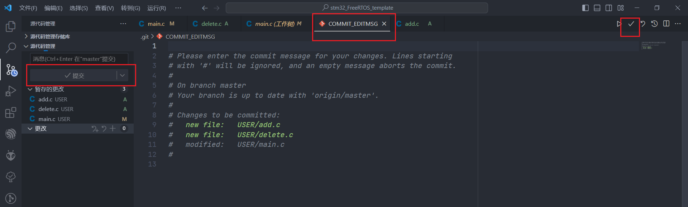
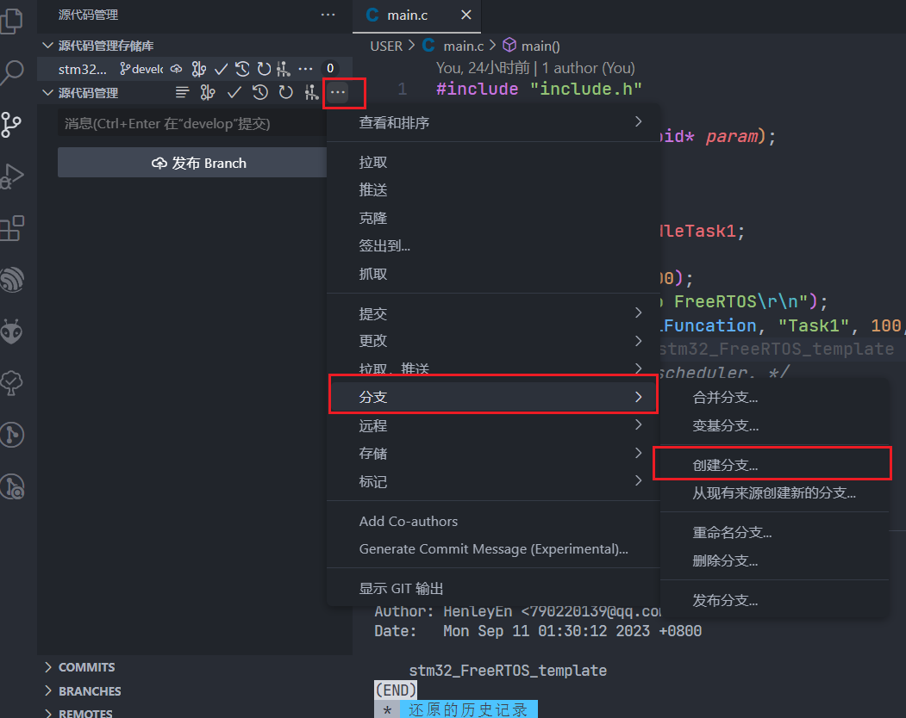
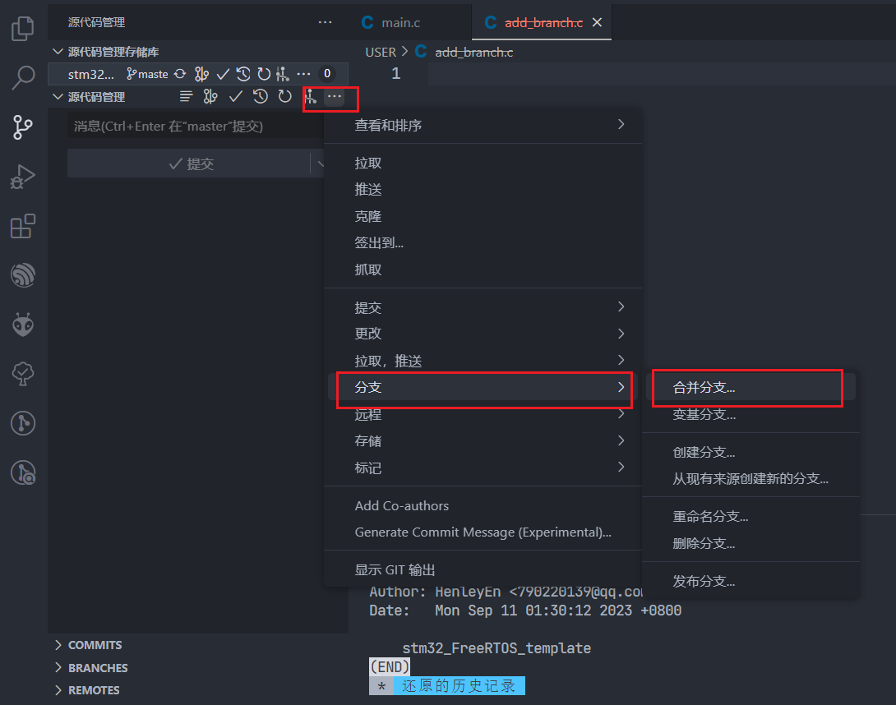
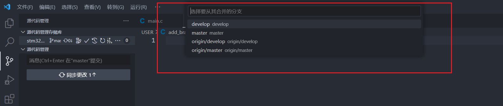
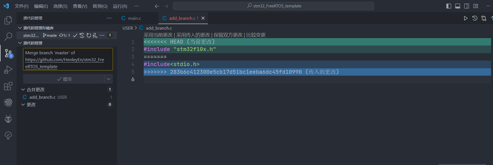
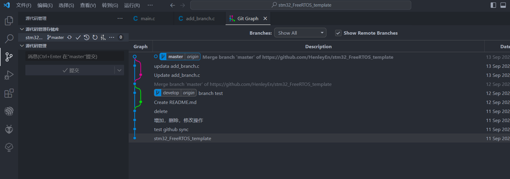

# GIT & VScode

## 1、优势

`VSCode`将`git`相关指令图形化和简易化，简单易懂。

使用插件：

- **Git Graph**
- **Git History**

## 2、实战操作

### 2.1、获取git仓库状态

**一个用于查看 Git 仓库当前状态的命令。**

```c
git sataus
```

### 2.2、对文件进行增、删、改



对文件进行修改后，在文件后面有显示相关文件操作：

- M `modified`
  你已经在github中添加过该文件，然后你对这个文件进行了修改，就会文件后标记M
- U `untracked`
  你在本地新建了这个文件，还未提交到github上，就会标记U
- D `delete`
  你删除了这个文件，vscode-git会记录下这个状态
- `6,U`
  表示有6个错误且untracked

点击相关修改文件，便可看见新旧文件差异(`diff`)



左：本地，右：仓库

### 2.3、对文件上传到暂存区（`Stage`）



点击`“ + ”`将修改文件放入暂存区；



- A `Add`

  git中无相关文件，需要增加文件

- M `modified`

​		你已经在github中添加过该文件，然后你对这个文件进行了修改，就会文件后标记M

- D `delete`

​		git中有相关文件，需要删除文件

### 2.4、提交



在提交代码（`commit`）时，需要写备注（`message`），再点击确认。

## 3、git中其他技巧

### 3.1、分支（`branch`）阐述

在平常开发中，一般都会对应三种环境，本地环境、测试环境、线上环境。开发的基本流程都是先在本地环境开发好,再把代码发布到测试环境测试，最后再发布到线上环境。

对于代码，我们使用Git分支进行管理，一般而言会对应两个分支,master和dev。

master分支主要用于线上发布使用,dev分支用于平常的开发和测试。除此之外，我们也可以创建多个分支，比如给某次的迭代开发创建一个分支、针对一次代码优化创建一个分支，或者针对一次Bug修复，我们可以新建个分支。

### 3.2、创建分支

```c
git branch branchname
```

VScode中



### 3.3、合并（`merge`）分支代码

合并分支前，创建develop分支，同时创建add_branch.c文件。

合并前必须先切换到合并仓库中，例如：需要将develop合并到master，则先切换至master分支，再进行合并。

**注意，合并前，俩个版本都要提交到本地版本库。**

git中

```c
git checkout master
git merga develop
```

VScode中



选择需要合并的分支



最后再进行一次同步分支，确保分支内容相同。

### 3.4、解决（`conflict`）冲突

当团队合作对相同的代码进行修改时，必定会产生冲突。在`commit`时就需要解决冲突（`conflict`）后才能进行合并代码。



需要将修改代码进行相应的处理，解决冲突才能进行重新`push`。

解决冲突后，能在历史（`history`）中查看相关`log`。


