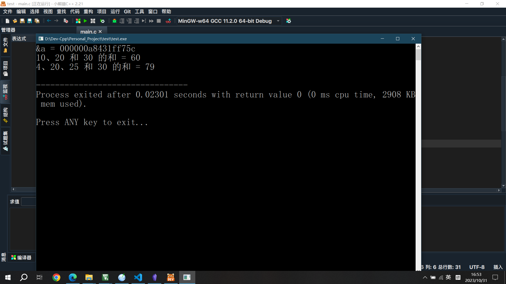

## 1、可变参数宏
```c
    va_start(ap, v);
    va_arg(ap, t)
	...
    va_end(ap);
```
### 1.1、va_start
**声明**
```c 
typedef char* va_list;
#define va_start(list,param1)   ( list = (va_list)&param1+ sizeof(param1) )

void va_start(va_list ap, last_arg);
```
**参数**
- **ap** -- 这是一个 **va_list** 类型的对象，它用来存储通过 **va_arg** 获取额外参数时所必需的信息。
- **last_arg** -- 最后一个传递给函数的已知的固定参数。
当函数设置为
```c
void test(int num, param1, param2, param3, ...);
```
此时的**param1**等参数是在调用时进行设置。
### 1.2、va_arg(ap, t)
**声明**
```c
#define va_arg(list,mode)   ( (mode *) ( list += sizeof(mode) ) )[-1]
```
**参数**
- **list** -- list是类型为va_list的指针
- **mode** -- mode参数描述了当前参数的类型

### 1.3、va_end(ap)
**声明**
```c
#define va_end(list) ( list = (va_list)0 )
```
**参数**
- list -- list是类型为va_list的指针
清除list可变参数列表
## 2、demo
```c
#include<stdarg.h>  
#include<stdio.h>  
  
int sum(int, ...);  
  
int main(void)  
{  
    int a = 10;  
    printf("&a = %p\r\n", &a);  
    printf("10、20 和 30 的和 = %d\n",  sum(3, a, 20, 30) );  
    printf("4、20、25 和 30 的和 = %d\n",  sum(4, 4, 20, 25, 30) );  
        return 0;  
}  
  
int sum(int num_args, ...)  
{  
    int val = 0;  
    va_list ap;  
    int i;  
    
    va_start(ap, num_args);  
    for(i = 0; i < num_args; i++)  
    {  
        val += va_arg(ap, int);  
    }  
    va_end(ap);  
        return val;  
}
```
### 2.1、现象


