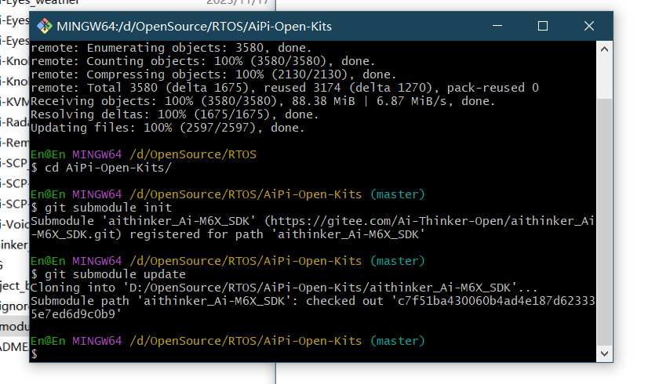
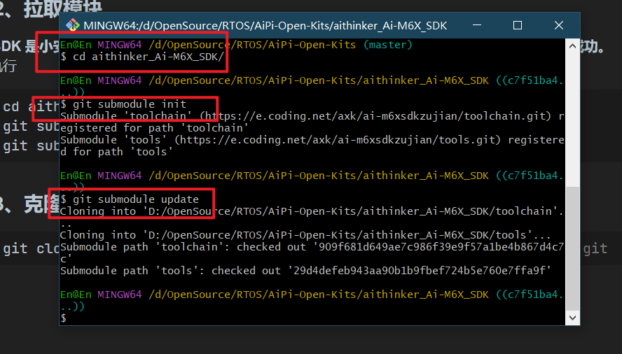
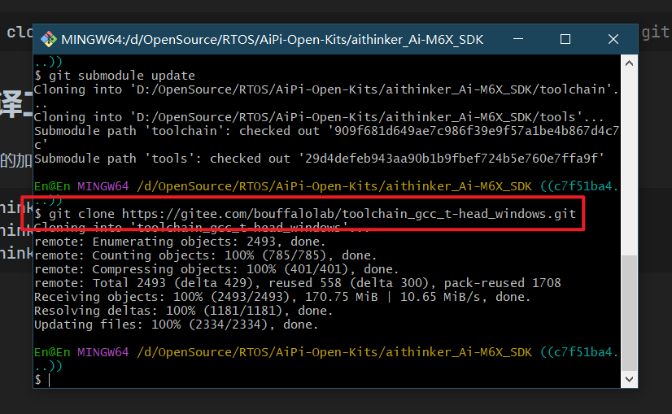
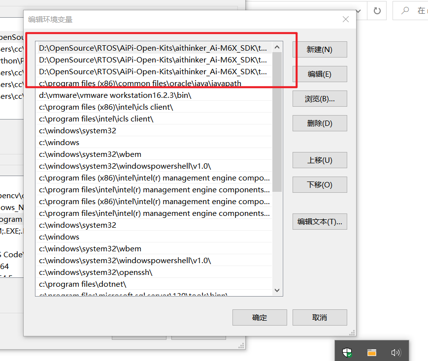
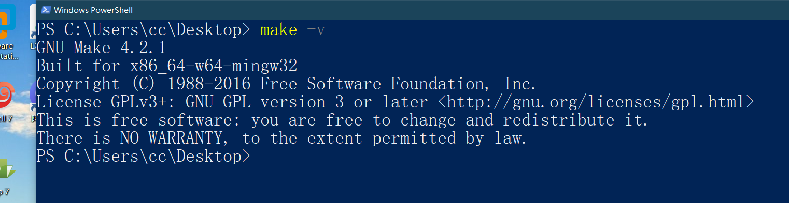
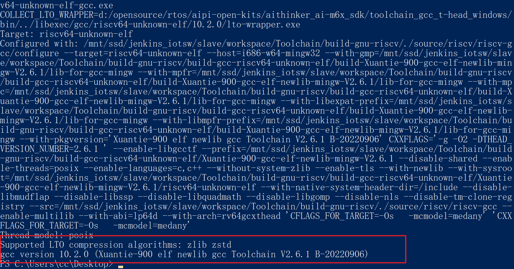
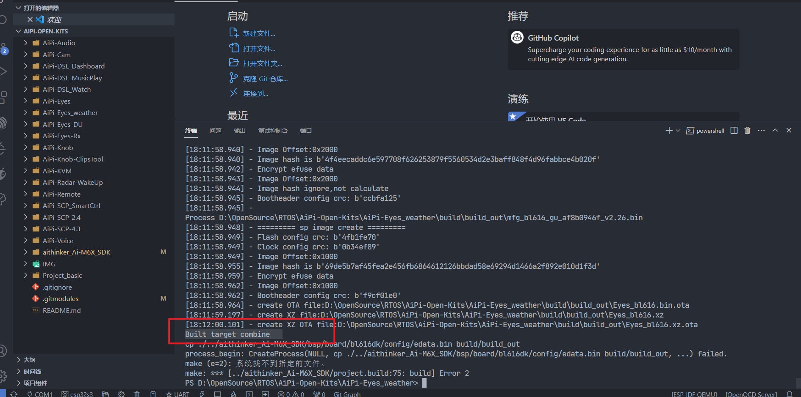

#  **搭建Ai-M61-32S开发环境**

## 1、安装相关工具

安装**VSCode**和**GIT**：


## 2、克隆源码工程

## 2.1、克隆源码

```c
git clone https://gitee.com/Ai-Thinker-Open/AiPi-Open-Kits.git
```


## 2.2、拉取M61的SDK子模块

### 2.2.1、修改子模块来源

**进入** `AiPi-Open-Kits` **中，用文本打开** `.gitmodules` **文件** **url** **参数中的** `github.com` **改成** `gitee.com`**：**


分别执行：

```c
cd AiPi-Open-Kits/
git submodule init
git submodule update
```



### 2.2.2、拉取模块

**M61 SDK 是小安派仓库的子模块，而 M61 SDK 自己也有子模块，所以也需要拉取，否则会编译不成功。**

逐条执行

```c
cd aithinker_Ai-M6X_SDK/
git submodule init
git submodule update
```



### 2.2.3、克隆使用的工具链

```c
git clone https://gitee.com/bouffalolab/toolchain_gcc_t-head_windows.git
```



## 3、编译工具路径设置

将三个文件的加入环境变量

```c
aithinker_Ai-M6X_SDK\toolchain_gcc_t-head_windows\bin
aithinker_Ai-M6X_SDK\tools\make
aithinker_Ai-M6X_SDK\tools\ninja
```




## 4、验证是否安装成功

**在桌面按住** `shift` **键点击** `鼠标右键` **打开** **PowerShell** **。在 PowerShell 输入：**

```c
make -v
```

输出信息



输入

```c
 riscv64-unknown-elf-gcc -v
```

输出信息



## 5、编译天气站程序

**AiPi-Eyes_weather 是天气站的源码，选中该文件之后，**`鼠标右键` **选择** `在集成终端中打开`**，然后在终端输入：**

```c
make
```

输出信息



