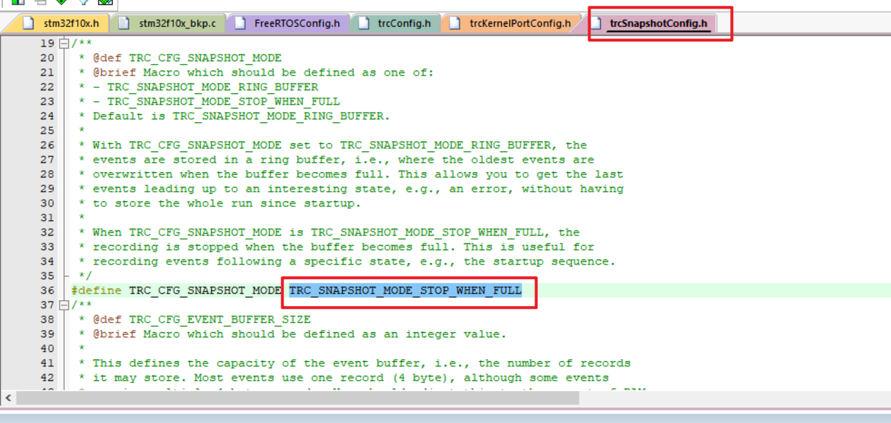

# Traceayzer 4

## 1、介绍

Tracealyzer 是视觉提示诊断的最佳解决方案，为嵌入式应用程序程序员提供对其运行时系统的惊人洞察力。这允许更轻松地调试系统级问题、发现应用程序设计缺陷以及量化应用程序的时间和资源利用率。确保您的代码可靠、响应迅速且高效。否则，找出原因。

## 2、破解

### 2.1、下载

下载Tracealyzer 4，版本4.6.5[Tracealyzer 4_4.6.5](https://percepio.com/download-tracealyzer/?f=Tracealyzer-4.6.3-windows64&p=Win64)

只针对4.6.5版本进行破解，其他版本需要其他方法。

根据硬汉论坛[最新版Tracealyzer4.6.3 - 开发环境 - 硬汉嵌入式论坛 - Powered by Discuz! (armbbs.cn)](https://www.armbbs.cn/forum.php?mod=viewthread&tid=112634)

需要下载

```text
1、Tracealyzer.exe	//论坛中有两个版本，需要下载评论区楼主发的第二个才能正常打开
2、Tracealyzer.exe.config
3、I_LOVE_DIV.rar
```

### 2.2、进行破解

安装Tracealyzer后，将下载的**Tracealyzer.exe**和**Tracealyzer.exe.config**进行覆盖，再使用解压软件将**I_LOVE_DIV.rar**解压，使用解压文件中的**TracealyzerKeyfileMaker.exe**软件进行密钥生成，将生成的密钥复制到**C:\ProgramData\Tracealyzer Data**文件路径中，即破解完成。

## 3、其他办法破解

通过对文件进行反编译，修改读取密钥的流程完成破解。根据博客流程操作。

[Tracealyzer Crack - elmagnifico's blog](https://elmagnifico.tech/2020/03/13/Tracealyzer-Crack/)

不过我没破解成功，都是修改文件后软件打不开。

使用搜索文本

```text
mkdir "D:\OpenSource\tracelyzer\Tracealyzer 4\cleaned"

de4dot -r "D:\OpenSource\tracelyzer\Tracealyzer 4" -ro "D:\OpenSource\tracelyzer\Tracealyzer 4\cleaned"

SignedLicense

https://percepio.com/dl2.php?f=Tracealyzer-4.3.5-windows64&p=Win64

de4dot-x64.exe -r "D:\OpenSource\tracelyzer\Tracealyzer 4" -ro "D:\OpenSource\tracelyzer\Tracealyzer 4\cleaned"
```

下载的文件放在**D:\OpenSource\tracelyzer**文件路径下。

## 4、使用

使用的是RTT进行快照模式检测。

### 4.1、文件结构


根据所使用的RTOS选择相应的接口，这里使用的是FreeRTOS，就使用FreeRTOS的接口。

其中


接口函数在**TraceRecorder**文件夹中。


主要接口文件，将整个**TraceRecorder**文件夹导入工程内，再将这几个文件加入工程。

工程文件结构：


这时候编译还会出错，因为有些配置没有设置好。

### 4.2、配置

需要更改几个配置文件：

`trcConfig.h`：配置整个Tracealyzer的配置文件。


`FreeRTOSConfig.h`：配置FreeRTOS系统文件，需要将调试模式（`configUSE_TRACE_FACILITY`）置1。


再需要将**Tracealyzer**的头文件包含：

```c
 #if ( configUSE_TRACE_FACILITY == 1 )
     #include "trcRecorder.h"
 #endif
```


### 4.3、修改相应的FreeRTOS版本和Trace模式

在`trcKernelPortConfig.h`设置模式


应对相应的FreeRTOS版本


修改快照模式的存储模式



再次编译后能发现还会报错，是因为调用了定时器，所以需要将软件定时器打开：


```c
#define configUSE_TIMERS                         1                              
#define configTIMER_TASK_PRIORITY                5      
#define configTIMER_QUEUE_LENGTH                 10                               
#define configTIMER_TASK_STACK_DEPTH          (configMINIMAL_STACK_SIZE*2)
```

再次编译，编译成功。

`PS:`如果遇到占用内存不足，则修改`FreeRTOSConfig.h`文件中所分配栈的大小，可以适当改小一点。

## 5、使用

以上对中间件进行配置完成，打开软件

将软件设置为`Jlink`模式：


选择相应的模式，和设置好log的文件路径。

进入快照模式


对`Jlink`进行设置


在main函数中调用`vTraceEnable(TRC_START)`初始化并使能跟踪，调用的位置须在硬件完成初始化之后，第一个内核对象创建之前。


## 6、对软件界面介绍


垂直时间轴视图窗口和事件记录窗口。
