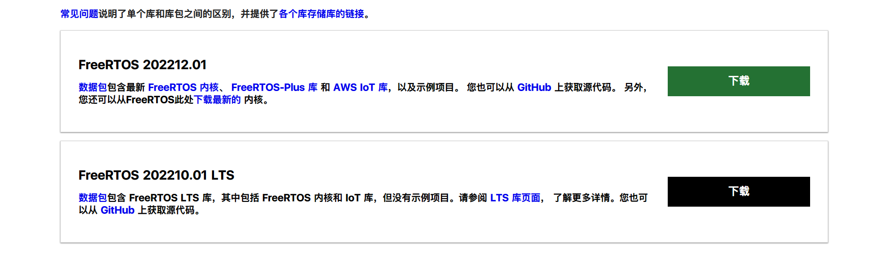
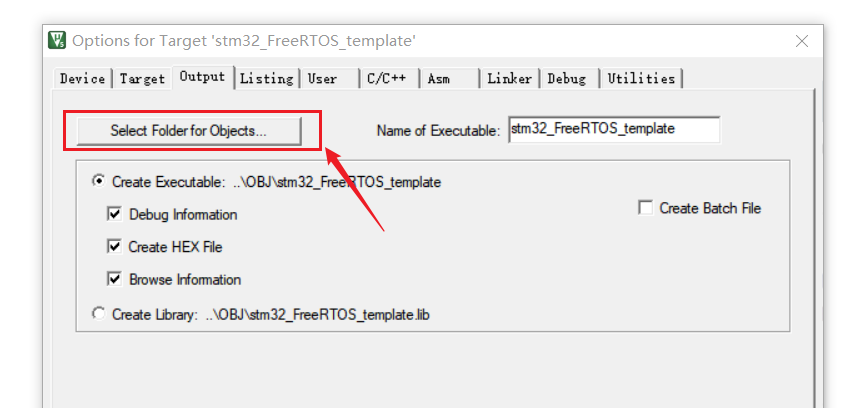
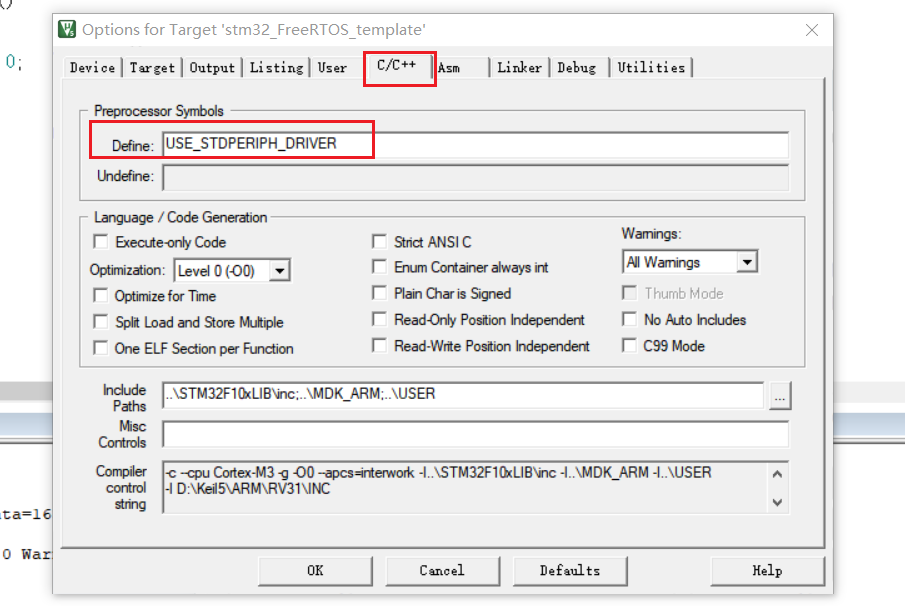
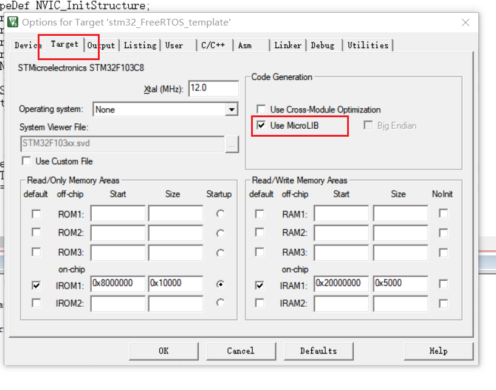
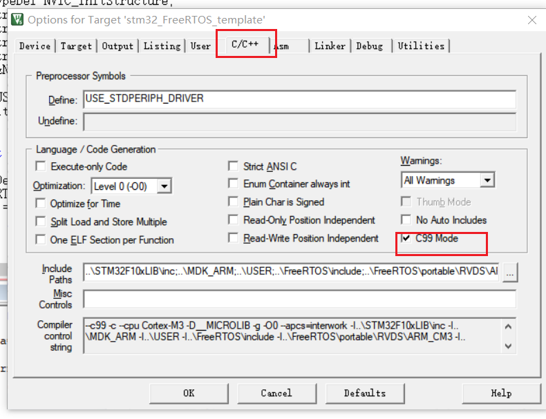

# FreeRTOS移植
## 1、FreeRTOS目录结构

### 1.1、FreeRTOS源码下载



网站地址：[FreeRTOS - Free RTOS Source Code Downloads, the official FreeRTOS zip file release download](https://www.freertos.org/zh-cn-cmn-s/a00104.html)

### 1.2、目录结构

```
FreeRTOS
├─ Demo				#配置各种开发板中的demo
├─ License			#版权文件
├─ README.md		
├─ Source			#源码
├─ Test				#测试代码
└─ links_to_doc_pages_for_the_demo_projects.url
```

以`STM32F3`为例，需要用到一下几个文件：

```
FreeRTOSv202212.01\FreeRTOSv202212.01\FreeRTOS\Source
FreeRTOSv202212.01\FreeRTOSv202212.01\FreeRTOS\Source\portable\MemMang
FreeRTOSv202212.01\FreeRTOSv202212.01\FreeRTOS\Source\portable\RVDS
```

- `Source`：包含FreeRTOS内核文件；
- `MemMang`：包含内存管理文件；
- `RVDS`：包含STM的M系内核文件，我们选择`M3`内核；

## 2、移植

### 2.1、设定模板工程目录

工程文件夹包含：

```
stm32_FreeRTOS_template
├─ FreeRTOS					#FreeRTOS内核文件
├─ MDK_ARM					#M3内核所需启动文件
├─ OBJ						#工程编译文件夹
├─ Project					#工程文件夹
├─ STM32F10xFWLib			#标准库或者HAL库
├─ User						#用户文件
├─ keilkilll.bat			#清理编译文件shell脚本
├─ stm32_FreeRTOS_template.uvgui.En
├─ stm32_FreeRTOS_template.uvopt
├─ stm32_FreeRTOS_template.uvproj
```

Keil工程中的文件目录（顺序不分先后）：

```
stm32_FreeRTOS_template
├─ User								#用户文件
├─ MDK_ARM							#M3内核所需启动文件
├─ FreeRTOS/source					#FreeRTOS内核文件
├─ FreeRTOS/port					#FreeRTOS配置M3内核文件、内存管理文件
├─ STM32F10xFWLib					#标准库或者HAL库
```

**若还有其他驱动文件，则增加驱动文件夹。**

### 2.2、工程文件内部文件

注意`User`和`MDK_ARM`两个文件夹；

`User`文件夹中必然包含：

```
User
├─ main.c								#main函数
├─ include.h							#main函数所包含的所有头文件
├─ stm32f10x_it.c						#M3标准库中断配置
├─ FreeRTOSConfig.h						#FreeRTOS配置文件
├─ stm32f10x_config.h					#M3内核的标准库配置，可以不加入工程
```

注意：**FreeRTOSConfig.h**文件在**FreeRTOS**的`DEMO`文件夹中复制一份；

`MDK_ARM`文件夹中包含：

```
MDK_ARM
├─ system_stm32f10x.c							#M3内核支持API
├─ startup_stm32f10x_hd.s						#M3内核启动文件
├─ core_cm3.c									#M3内核支持API
├─ stm32f10x.h									#stm32f10x总头文件
```

`FreeRTOS`部分文件包含：

```
├─ FreeRTOS/source					#FreeRTOS内核文件
	├─ croutine.c						#协程
	├─ event_group.c					#事件组
	├─ list.c							#链表
	├─ queue.c							#队列
	├─ tasks.c							#任务
	├─ timers.c							#定时器
├─ FreeRTOS/port					#FreeRTOS配置M3内核文件、内存管理文件
	├─ heap_4.c						#内存管理方法4
	├─ port.c						#M3内核的接口文件
	├─ portmarco.c					#port.c对应的头文件
```

### 2.3、创建无FreeRTOS模板工程

需要将`STM32F10x`标准库文件移植到以下文件夹：

```
stm32_FreeRTOS_template
├─ MDK_ARM					#M3内核所需启动文件
├─ OBJ						#工程编译文件夹
├─ Project					#工程文件夹
├─ STM32F10xFWLib			#标准库或者HAL库
├─ User						#用户文件
```

- `OBJ`：保存`output`输出文件



- `Project`：工程文件夹；

当编译依旧报错时，则需要对Keil进行设置：

1. 打开Keil中的魔术棒；
2. 选择`C/C++`，增加头文件路径和修改相关参数：



在`Define`中输入**USE_STDPERIPH_DRIVER**，或者**STM32F10X_HD**将编译器设置为使用标准库。

3. 重新编译；

### 2.4、移植FreeRTOS

将上述文件移动至相关文件夹和相关工程文件夹中，增加头文件路径。

编译文件发现报错：


缺少`FreeRTOSConfig.h`文件，在**FreeRTOS**提供的**Demo**中复制一份到**User**文件夹，并加入工程；

对移植代码进行测试，检查是否成功：

```c
#include "include.h"

void Task1Funcation(void* param);

int main()
{
	TaskHandle_t xHandleTask1;

	printf("Hello FreeRTOS\r\n");
	xTaskCreate( Task1Funcation, "Task1", 100, "Task1", 1, &xHandleTask1);
	
		/* Start the scheduler. */
	vTaskStartScheduler();
	return 0;
}

void Task1Funcation(void* param)
{
	while(1)
		{
			printf(param);
			printf("\r\n");
		}
}
```

一般会遇到debug时卡住，是因为**FreeRTOS**修改了`SVC_Handler`，`PendSV_Handler`，`SysTick_Handler`。

三个文件在`sitm32f10x_it.c`中，只需要将三个函数进行注释掉，同时在`FreeRTOSConfig.h`中增加三个函数的宏定义

```c
#define vPortSVCHandler SVC_Handler
#define xPortPendSVHandler PendSV_Handler
#define xPortSysTickHandler SysTick_Handler
```

再次编译。

## 3、增加串口打印和重定义

串口打印代码

```c
void USART_Config(uint32_t BaudRate)
{
	GPIO_InitTypeDef GPIO_InitStructure;
	USART_InitTypeDef USART_InitStructure;
	
	RCC_APB2PeriphClockCmd(RCC_APB2Periph_USART1, ENABLE);
	RCC_APB2PeriphClockCmd(RCC_APB2Periph_GPIOA, ENABLE);

	GPIO_InitStructure.GPIO_Mode = GPIO_Mode_AF_PP;
	GPIO_InitStructure.GPIO_Pin = GPIO_Pin_9;
	GPIO_InitStructure.GPIO_Speed = GPIO_Speed_50MHz;
	GPIO_Init(GPIOA, &GPIO_InitStructure);
	
	GPIO_InitStructure.GPIO_Mode = GPIO_Mode_IPU;
	GPIO_InitStructure.GPIO_Pin = GPIO_Pin_10;
	GPIO_InitStructure.GPIO_Speed = GPIO_Speed_50MHz;

	GPIO_Init(GPIOA, &GPIO_InitStructure);

	USART_InitStructure.USART_BaudRate = BaudRate;
	USART_InitStructure.USART_HardwareFlowControl = USART_HardwareFlowControl_None;
	USART_InitStructure.USART_Mode = USART_Mode_Rx | USART_Mode_Tx;
	USART_InitStructure.USART_Parity = USART_Parity_No;
	USART_InitStructure.USART_StopBits = USART_StopBits_1;
	USART_InitStructure.USART_WordLength = USART_WordLength_8b;
	
	USART_ITConfig(USART1, USART_IT_RXNE, ENABLE);
	USART_Init( USART1, &USART_InitStructure);
	
	NVIC_InitTypeDef NVIC_InitStructure;
	NVIC_InitStructure.NVIC_IRQChannel = USART1_IRQn;
	NVIC_InitStructure.NVIC_IRQChannelCmd = ENABLE;
	NVIC_InitStructure.NVIC_IRQChannelPreemptionPriority = 1;
	NVIC_InitStructure.NVIC_IRQChannelSubPriority = 1;
	NVIC_Init(&NVIC_InitStructure);
	
	USART_Cmd(USART1, ENABLE);
	NVIC_PriorityGroupConfig(NVIC_PriorityGroup_2);
}

```

串口重定义代码：

```c
int fputc(int ch, FILE* f)
{
	USART_TypeDef* USARTx = USART1;
	while((USARTx->SR & (1 << 7)) == 0); 
	USARTx->DR = ch;
	return ch;
}
```

## 4、注意

对工程设置要勾选`Use micoLIB`和 `C99 Mode`。





