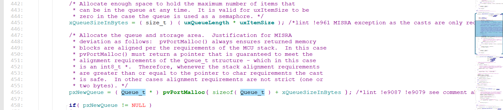

# 队列

## 1、互斥引入

当多个任务对同一参数进行修改时，会对数据禅产生错误、

创建`Task1`和`Task2`，创建全局变量`a`，`Task1`和`Task2`的功能都是让`a++`；

```c
void Task1Funcation(void* param)
{
    while(1)
    {
        a++;
    }
}

void Task1Funcation(void* param)
{
    while(1)
    {
        a++;
    }
}

xTaskCreate( Task1Funcation, "Task1", 100, NULL, 1, &xHandleTask1);
xTaskCreate( Task2Funcation, "Task2", 100, NULL, 1, NULL);
```

每个任务都是按照`FreeRTOS`的`Ticks`中断来交替执行（相同优先级）。
[20230607_汇编，局部全局变量，栈](../01.%20零碎知识/20230607_汇编，局部全局变量，栈.md)
函数栈的保存现场导致函数对全局变量的修改出错，所以引入互斥概念，由队列实现。

当`Task1`调用公共代码时，其他任务不能调用公共代码，其他任务同理。

## 2、队列机制

### 2.1、队列实现互斥

实例：有三个任务，`Task1`，`Task2`，`Task3`。一一个全局变量a。`Task1、3`都对`a`进行操作，`Task2`读取a的值。

创建一个队列`queue`，`Task1、3`都向队列发送数据，`Task2`接收队列数据。当遇到**Tick中断**需要切换任务时，队列发送、接收的API中将`中断(不是所有中断)`关闭，调用完临界区代码后再开中断（等同于裸机代码）。

以`xQueueSend`举例：

关中断


开中断


### 2.2、休眠唤醒

写队列API功能：

1. 若队列中有数据，则返回队列数据；
2. 若队列中无数据，则让函数进行休眠；

场景：

两个任务Task1、2，Task1在一定条件下进行写队列，Task2进行读队列。

1. 当T1时刻，Task1启动，没有达到条件，不向队列中写；
2. 当T2时刻，Task2启动，Task2读取队列，队列中无数据，则Task2进入休眠状态；
3. 当T3时刻，Task1运行，没有达到条件，不向队列中写；
4. 当T4时刻，由于Task2进入了休眠状态，所以Task1继续运行；
5. 当T5时刻，Task1继续运行，且满足了写队列的条件，向队列中写入数据，同时唤醒Task2；
6. 当T6时刻，Task2开始运行；

### 2.3、队列的核心

关中断，环形缓冲区，链表操作；

当任务进行休眠时，先修改任务状态，从就绪态修改为等待态，再将休眠任务放入队列任务链表。

链表有两个链表：

1. list for Recvice：接收任务等待链表
2. list for Send：发送任务等待链表

### 2.4、环形缓冲区
[20230724_环形缓冲区](../01.%20零碎知识/20230724_环形缓冲区.md)

## 3、队列结构体及机制

### 3.1、队列结构体


环形缓冲区结构体


创建队列API

```c
xQueueCreate( uxQueueLength, uxItemSize )
```



队列结构体大小


### 3.2、读过程 xQueueReceive

读队列API：

```c
BaseType_t xQueueReceive( QueueHandle_t xQueue,
                          void * const pvBuffer,
                          TickType_t xTicksToWait )
```


### 3.3、写过程 xQueueSend

写过程API

```c
xQueueSend( xQueue, pvItemToQueue, xTicksToWait )
```


流程：


### 3.4、超时唤醒

在FreeRTOS的Ticks中断进行处理任务唤醒；

```c
void xPortSysTickHandler( void );
```


