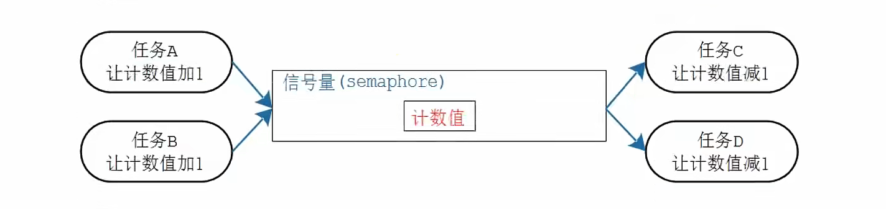
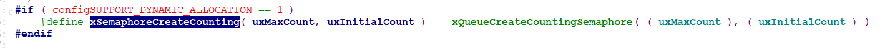
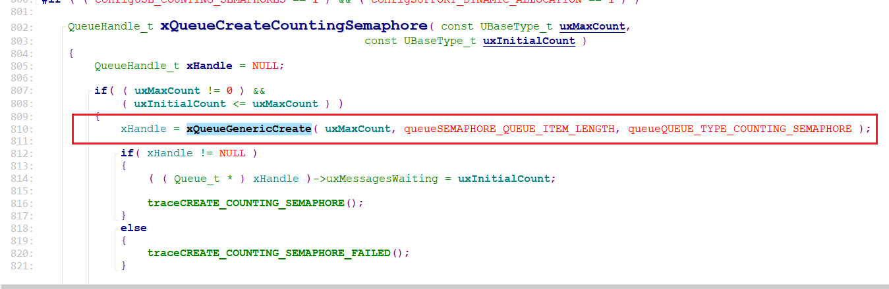
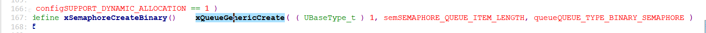
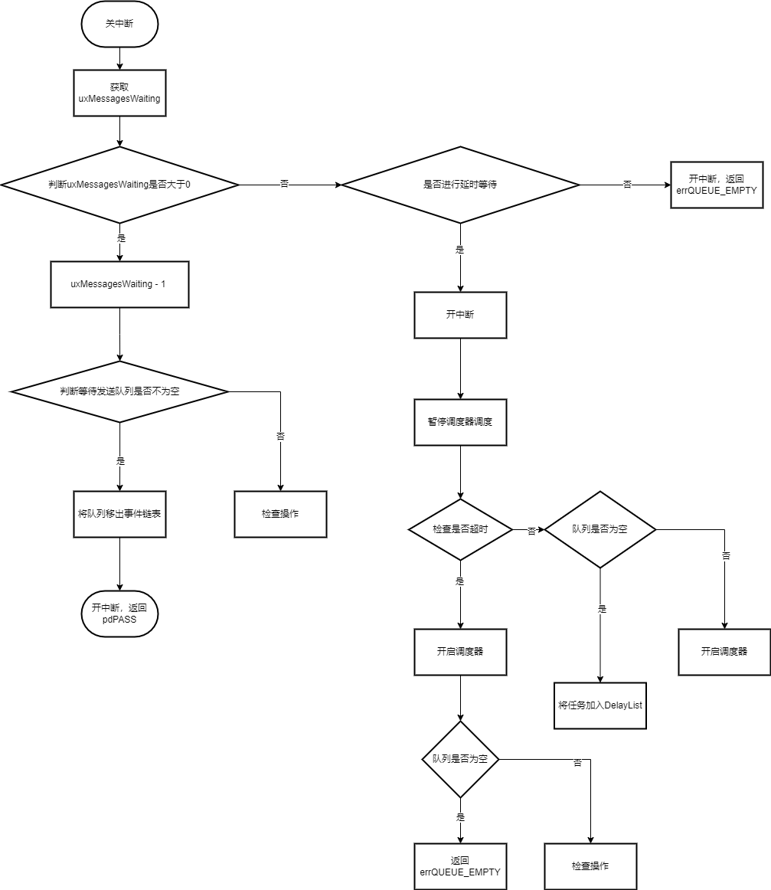
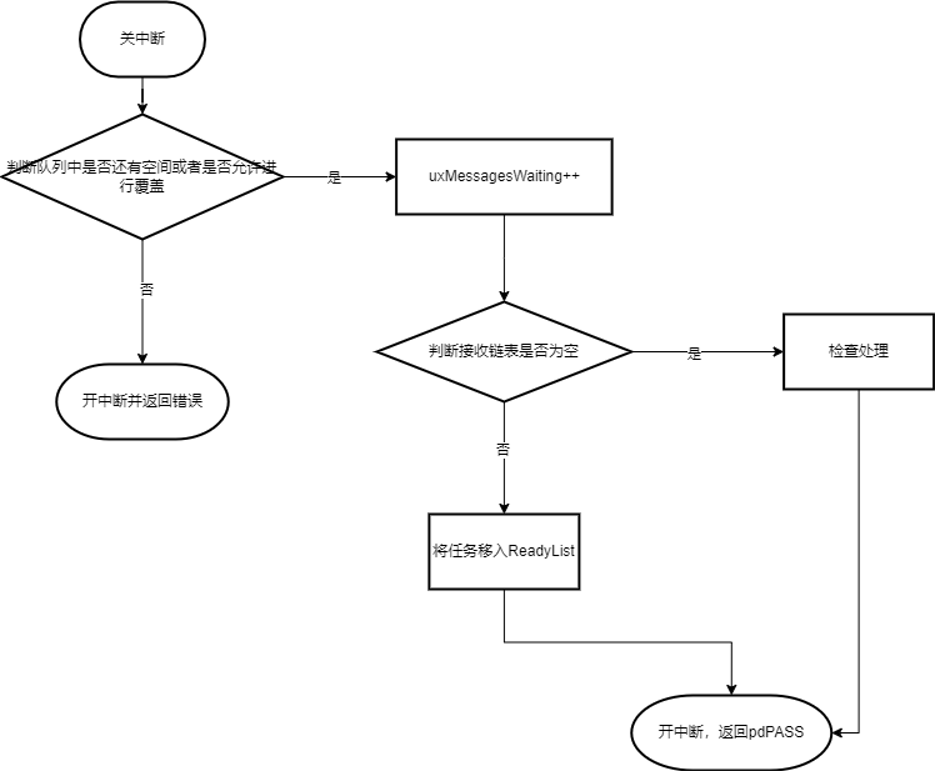

# 信号量

## 1、信号量介绍

计算资源个数。

## 2、信号量内部机制

### 2.1、信号量功能



1. 对资源数量进行保护；
2. 对任务进行休眠唤醒；

### 2.2、信号量操作流程

#### 2.2.0、创建信号量

创建信号量`API`

```c
/* 创建计数信号量 */
xSemaphoreCreateCounting( uxMaxCount, uxInitialCount );

/* 创建二进制信号量 */
xSemaphoreCreateBinary();
```

创建信号量是特殊的队列操作，创建计数信号量：



其中



```c
#define queueSEMAPHORE_QUEUE_ITEM_LENGTH    ( ( UBaseType_t ) 0 )
#define queueQUEUE_TYPE_COUNTING_SEMAPHORE    ( ( uint8_t ) 2U )
```

创建长度为`0`的队列，对队列结构体中的`uxMessagesWaiting`进行复用，通过计数`uxMessagesWaiting`的值实现计数信号量；

而二进制信号量：



```c
#define queueSEMAPHORE_QUEUE_ITEM_LENGTH    ( ( UBaseType_t ) 0 )
#define queueQUEUE_TYPE_BINARY_SEMAPHORE      ( ( uint8_t ) 3U )
```

#### 2.2.1、接收（Take）信号量

`API：`

```c
xSemaphoreTake( xSemaphore, xBlockTime );
```



#### 2.2.2、发送（Give）信号量

`API：`

```c
#define xSemaphoreGive( xSemaphore )    \
xQueueGenericSend( ( QueueHandle_t ) ( xSemaphore ), \
					NULL, \
					semGIVE_BLOCK_TIME, \
					queueSEND_TO_BACK )

#define semGIVE_BLOCK_TIME                  ( ( TickType_t ) 0U )
```

因为`semGIVE_BLOCK_TIME`的值为0，所以发送信号量不进行等待。


