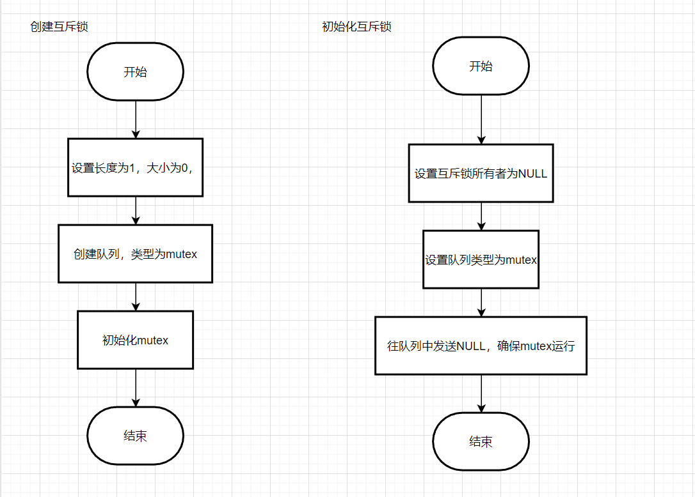

# 互斥量（MUTEX）
互斥量不能在ISR中使用；
互斥量的初始值为1；
基本流程为：create->take->give->take->give
## 1、互斥量与信号量异同

相同点：

1. 都是由队列进行实现；
2. 信号量中的二进制信号量和互斥量中的计数值都是0、1；

不同点：

1. 信号量中有计数信号量、二进制信号量，而互斥量没有分类；
2. 互斥量与信号量之间最大的差别是优先级继承、反转；

## 2、优先级反转和继承
[04. 互斥量](../02.%20FreeRTOS/04.%20互斥量.md)

## 3、互斥量代码流程

必须在`FreeRTOS_Config.h`中对`configUSE_MUTEXES`进行配置；

### 3.1、创建互斥量

`API：`

```c
#if ( ( configSUPPORT_DYNAMIC_ALLOCATION == 1 ) && ( configUSE_MUTEXES == 1 ) )
    #define xSemaphoreCreateMutex()    xQueueCreateMutex( queueQUEUE_TYPE_MUTEX )
#endif
```

```c
#define configUSE_MUTEXES		( 1 )
```



### 3.2、接收（Take）互斥量

`API：`

```c
 #define xSemaphoreTake( xSemaphore, xBlockTime )    xQueueSemaphoreTake( ( xSemaphore ), ( xBlockTime ) )
```

流程：


其中需要关注的内部函数：

```c
/* 优先级继承函数 */
BaseType_t xTaskPriorityInherit( TaskHandle_t const pxMutexHolder );
```


### 3.3、发送（Give）互斥量

`API：`

```c
#define xSemaphoreGive( xSemaphore )    \
			xQueueGenericSend( ( QueueHandle_t ) ( xSemaphore ), NULL, semGIVE_BLOCK_TIME, queueSEND_TO_BACK )

```

流程：


需要关注相关API：

```c
static BaseType_t prvCopyDataToQueue( Queue_t * const pxQueue,
                                      const void * pvItemToQueue,
                                      const BaseType_t xPosition )
```

根据队列类型不同进行不同的操作。
