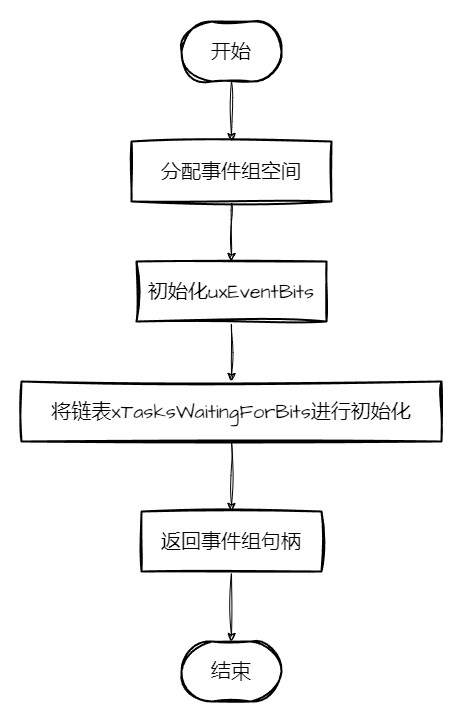
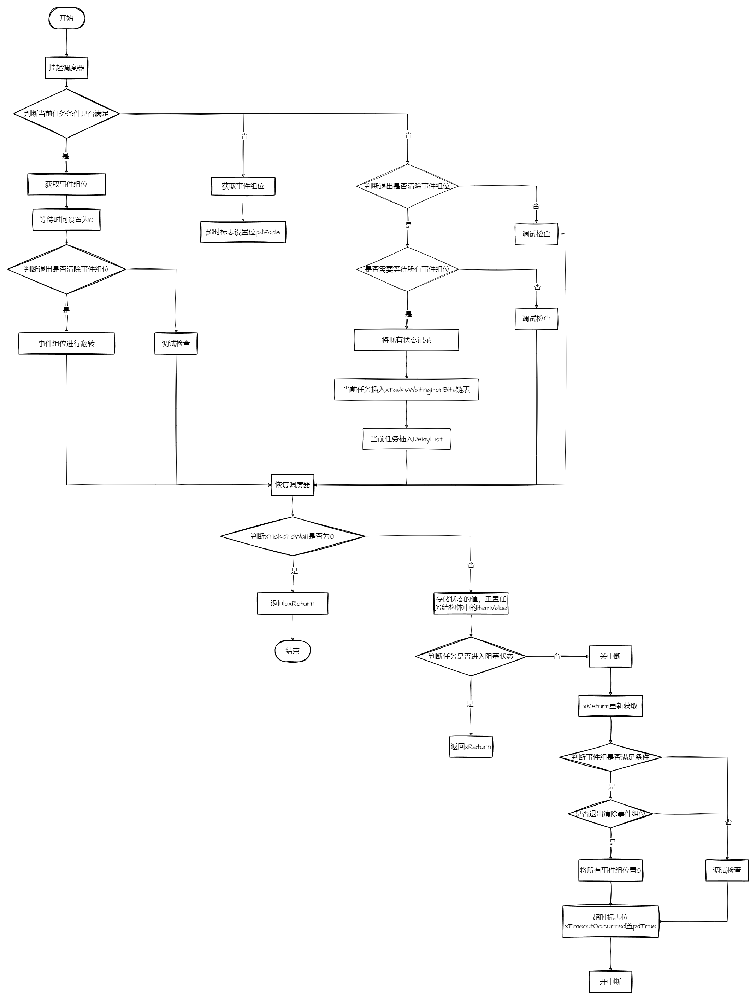
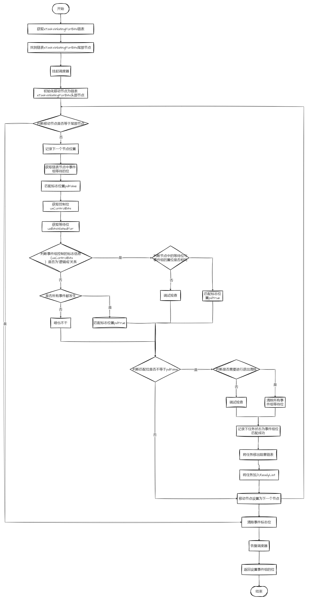

# 事件组

## 1、概述

事件组是FreeRTOS提供另一种事件传递的方法，它与队列和信号量的不同点：

- 时间组允许任务在阻塞态下等待一个或多个事件。
- 事件发生时，事件将取消阻塞等待同一事件或事件组合的所有任务。

事件组的这些特性可以用于多个任务同步，将事件广播到多个任务，允许任务在阻塞态下等待一组事件中的任何一个发生，并允许任务在阻塞态等待多个事件以完成多个操作。有时也可以用单个时间组替代多个二值信号量，以减少RAM的使用。
事件组功能是可选的，要使用事件组的功能，需要将`event_groups.c`添加到项目中。

## 2、内部机制

### 2.1、事件组结构体

```c
typedef struct EventGroupDef_t
{
    EventBits_t uxEventBits;
    List_t xTasksWaitingForBits; /*< List of tasks waiting for a bit to be set. */
} EventGroup_t;

```

- `uxEventBits`：当前事件，里面每一位表示一个事件
- `xTasksWaitingForBits`：存储等待某些位的任务

### 2.2、创建事件组

```c
EventGroupHandle_t xEventGroupCreate( void );
```

流程：



### 2.3、等待事件组

```c
EventBits_t xEventGroupWaitBits( EventGroupHandle_t xEventGroup,
                                 const EventBits_t uxBitsToWaitFor,
                                 const BaseType_t xClearOnExit,
                                 const BaseType_t xWaitForAllBits,
                                 TickType_t xTicksToWait );
```

- `xEventGroup`：事件组句柄
- `uxBitsToWaitFor`：等待哪一位事件
- `xClearOnExit`：是否退出清除所等待的事件位
- `xWaitForAllBits`：是否等待所有设置的事件位，等于“或、与”
- `xTicksToWait`：需要等待的时间

基本流程：



### 2.4、设置事件

```c
EventBits_t xEventGroupSetBits( EventGroupHandle_t xEventGroup,
                                const EventBits_t uxBitsToSet );
```

- `xEventGroup`：事件组句柄
- `uxBitsToSet`：设置哪一位作为事件

基本流程：

1. 设置事件位
2. 唤醒 `xTasksWaitingForBits `**“所有”**满足条件的任务



## 3、关中断和挂起调度器区别

### 3.1、关中断

```c
taskENTER_CRITICAL();
```

关闭中断后，与裸机程序相同，避免有任务在中断中对队列，信号量，互斥量进行操作

### 3.2、挂起调度器

```c
vTaskSuspendAll();
```

关闭调度器后，可以接收中断，可以在队列，信号量，互斥量中进行读写。

**不能在中断中进行事件组等待！！**

## 4、事件组（除等待事件组API）不关中断的原因

以`xEventGroupSetBitsFromISR`为例：

```c
BaseType_t xEventGroupSetBitsFromISR( EventGroupHandle_t xEventGroup,
                                     const EventBits_t uxBitsToSet,
                                     BaseType_t * pxHigherPriorityTaskWoken )
{
    BaseType_t xReturn;

    traceEVENT_GROUP_SET_BITS_FROM_ISR( xEventGroup, uxBitsToSet );
    xReturn = xTimerPendFunctionCallFromISR( vEventGroupSetBitsCallback, 
                                            ( void * ) xEventGroup, 
                                            ( uint32_t ) uxBitsToSet, 
                                            pxHigherPriorityTaskWoken ); /*lint !e9087 Can't avoid cast to void* as a generic callback function not specific to this use case. Callback casts back to original type so safe. */

    return xReturn;
}
```

其中`xTimerPendFunctionCallFromISR`作用是将事件组写入队列中，当队列中有写入，便有任务接收，所以能将接收队列的任务进行唤醒，当退出中断服务程序时，能够进行相应的任务切换。

```c
BaseType_t xTimerPendFunctionCallFromISR( PendedFunction_t xFunctionToPend,
                                         void * pvParameter1,
                                         uint32_t ulParameter2,
                                         BaseType_t * pxHigherPriorityTaskWoken )
{
    DaemonTaskMessage_t xMessage;
    BaseType_t xReturn;

    /* Complete the message with the function parameters and post it to the
             * daemon task. */
    xMessage.xMessageID = tmrCOMMAND_EXECUTE_CALLBACK_FROM_ISR;
    xMessage.u.xCallbackParameters.pxCallbackFunction = xFunctionToPend;
    xMessage.u.xCallbackParameters.pvParameter1 = pvParameter1;
    xMessage.u.xCallbackParameters.ulParameter2 = ulParameter2;

    xReturn = xQueueSendFromISR( xTimerQueue, &xMessage, pxHigherPriorityTaskWoken );

    tracePEND_FUNC_CALL_FROM_ISR( xFunctionToPend, pvParameter1, ulParameter2, xReturn );

    return xReturn;
}
```

中断服务程序需要执行迅速，保证程序的实时性。当进入中断服务程序时，只是起到一个标记或者唤醒的作用，退出服务程序时，相应的行为通过任务的方式进行执行，确保了程序的实时性。
