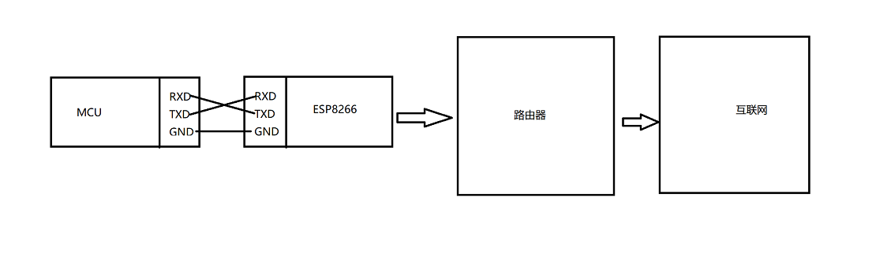

# MQTT连接STM32

## 1、程序分层

1. `platform_net_socket.c`是网络收、发、连接数据相关api
2. 网卡命令函数，这里是使用`esp8266`的AT命令
3. 控制芯片的驱动层，使用`stm32`中`USART`通信

## 2、基础连接



## 3、需要补充的mqtt函数

```c
platform_net_socket_connect
platform_net_socket_close
platform_net_socket_recv_timeout
platform_net_socket_write_timeout
```

