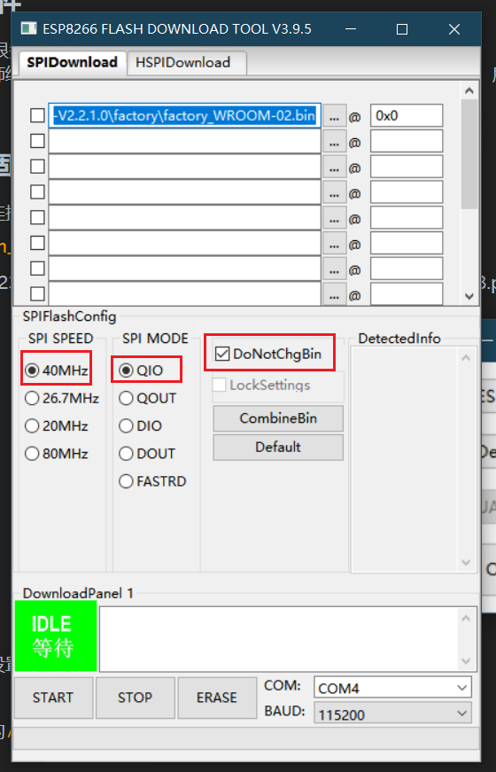
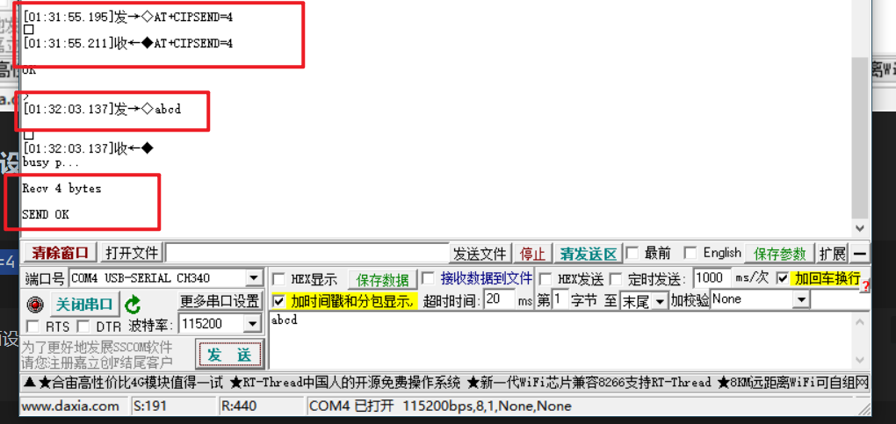
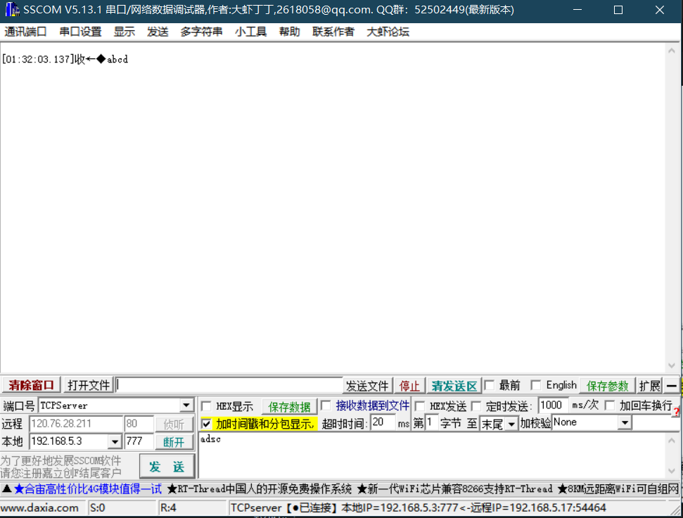

# ESP8266

## 1、概述

**ESP8266 Wi-Fi模块作为可以进行WiFi传输的模块集成了业内领先的Tensilica L106超低功耗32位微型MCU，带有16位精简模式，主频可达160MHz。同时支持RTOS（Real Time Operating System）集成Wi-Fi MAC/BB/RF/PA/LNA和 IEEE802.11 b/g/n 协议，支持完整的TCP/IP协议栈，也支持STA（Station），AP（Access Point），ATA+AP三种模式。**

## 2、作用

- esp8266可以作为辅助模块进行数据传输
- 可以作为mcu进行数据处理和传输

## 3、AT固件+ESP8266

### 3.0、准备

- AT固件
- 刷写工具`flash_download_tool`：乐鑫官网下载
- 一根能进行数据传输的USB
- 一块`ESP8266`开发板

### 3.1、AT固件

网络上AT固件很多版本，各有优势，选择乐鑫的AT固件进刷写。

由于韦东山老师给的乐鑫`ESP8266_NonOS_AT_Bin_V1.7.4`固件版本过低，所以我选择在乐鑫官网下载了最新的AT固件`ESP8266-IDF-AT_V2.2.1.0`进行刷写。

### 3.2、刷写固件步骤
- 将开发板连接PC，并且PC检测到开发板
- 设置`flash_download_tool`，将开发板进行以下设置


- 将开发板设置，注意将`DoNotChgBin`进行勾选，选择相应的端口和正确的波特率（一般为`115200`）
- 有时烧写不成功可以使用**DIO**模式



- 选择相应的`AT`固件


选择需要刷写的AT固件，偏移初始位置设置为`0x00`。

- 刷写固件，等待刷写结束，RST开发板

## 4、实验

### 4.0、准备

- `sscom5`软件
- `ESP8266 Non-OS AT 指令使用示例_V1.3.pdf`

### 4.1、检测AT固件

发送

```shell
AT
```

接收

```shell
AT

OK
```


注意勾选加回车换行选项

### 4.2、配置WIFI模式

发送

```shell
AT+CWMODE=3						//	softAP+station	mode
```

接收

```shell
AT+CWMODE=3	

OK
```


### 4.3、连接路由器

发送

```shell
AT+CWJAP="SSID","password"							//	SSID and password of router
```

- `SSID`：WIFI名称，不能连接5G WIFI，只能连接2.4G
- `password`：WIFI密码
接收

```shell
AT+CWJAP="SSID","password"
//AT+CWJAP="ZTE-Fhz2KN","..zx1551"

WIFI CONNECT
WIFI GOT IP

OK
```


开发板已经连接上路由器。

### 4.4、查询ESP8266设备的IP地址

发送

```shell
AT+CIFSR
```

接收

```shell
+CIFSR:APIP,"192.168.4.1"
+CIFSR:APMAC,"52:02:91:da:f1:7c"
+CIFSR:STAIP,"192.168.5.17"
+CIFSR:STAMAC,"50:02:91:da:f1:7c"

或
AT+CIFSR

+CIFSR:APIP,"192.168.4.1"
+CIFSR:APMAC,"52:02:91:da:f1:7c"

OK
```

- **<”APIP”>**: ESP8266 SoftAP 的 IPv4 地址
- **<”APMAC”>**: ESP8266 SoftAP 的 MAC 地址
- **<”STAIP”>**: ESP8266 station 的 IPv4 地址
- **<”STAMAC”>**: ESP8266 station 的 MAC 地址

### 4.5、利用sscom5设置PC为服务端

多开一个`sscom5`，将其设置为`TCPServer`


选择相应的本地IP地址，设置端口，点击本地下拉选项进行选择，此时PC端已经部署成为了一个TCP服务器。

这里设置为：

- IP：192.168.5.3
- 端口：777

点击侦听，开始侦听网络信息。

### 4.6、ESP8266作为TCP Client接入路由器

利用串口进行发送

```shell
AT+CIPSTART="TCP","192.168.5.3",777	
```

接收

```shell
OK
```


### 4.7、ESP8266设备向服务端发送数据

发送

```shell
AT+CIPSEND=4	
>abcd
```

- CIPSEND：后面设定需要发送的字符数量

接收

```shell
SEND OK
```

发送端



接收端



### 4.8、服务端向ESP8266发送数据

发送端


必须勾选上**加回车换行**选项。

接收端


数据包显示格式

```shell
+IPD,n,xxxxxx	//n是字符长度，xxxxx是字符串内容
```

